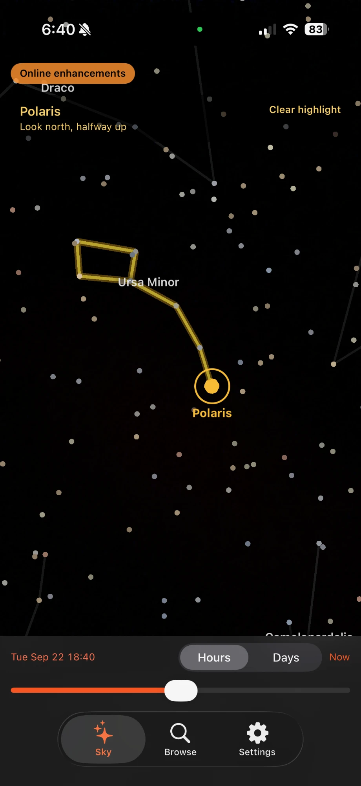
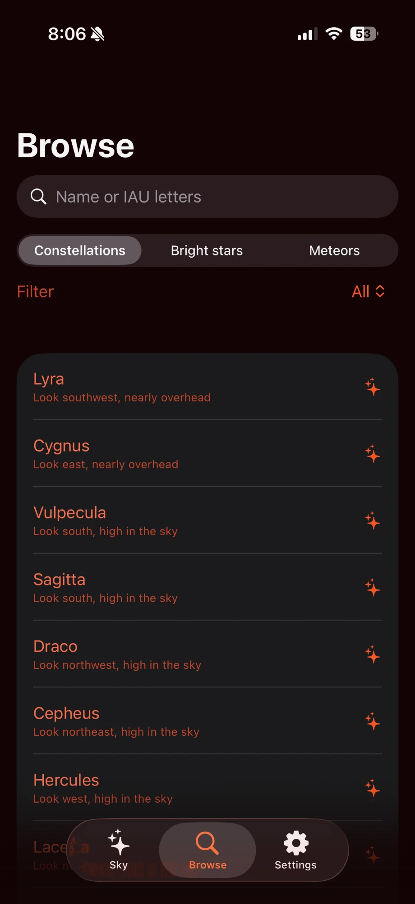
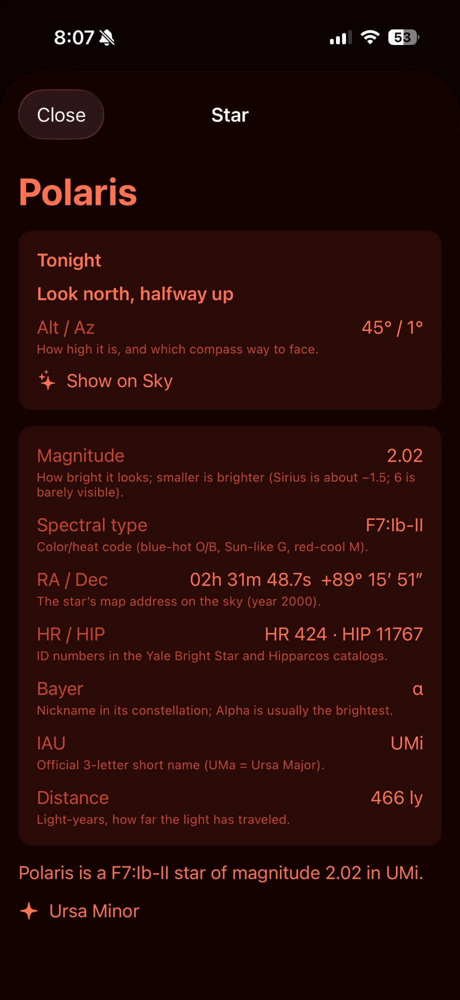

# Ursa Sky

Offline AR planetarium for iPhone (iOS 17, Swift 5.9). Point your phone at the night sky and see constellations, stars, and their names overlaid on live camera — **all without needing the internet.** SceneKit + ARKit overlay a bundled star catalog with real-time altitude/azimuth pointing.



**Core features work completely offline:** tap to identify any visible star and see its catalog details—magnitude, spectral type, distance, constellation. Browse the full catalog by constellation or search by name. ISS pass predictions and online enhancements are the only optional network features.



The app bundles 9,096 stars from the Yale Bright Star Catalogue, 88 IAU constellations with traditional stick-figure outlines, 333 named stars, and support for 146 cities to set your observing location. A night-mode red filter preserves dark adaptation.



Tap any star to see its full record: IAU name, HR/HIP catalog numbers, spectrum, distance in light-years, altitude/azimuth for tonight, and which constellation it belongs to. The catalog is compiled and committed so **a fresh install needs no download.**

## Getting Started

Open `UrsaSky.xcodeproj` in Xcode, choose an iPhone simulator or device, and run the **Ursa Sky** scheme.

```
xcodebuild -scheme UrsaSky -destination 'platform=iOS Simulator,name=iPhone 16,OS=18.3.1' test
```

If that simulator name is missing, list destinations with `xcodebuild -scheme UrsaSky -showdestinations`.

## Layout

```
UrsaSky.xcodeproj
UrsaSky/
  App/                 SwiftUI shell, AppState, RootView
  Astronomy/           Meeus JD, GMST, precession, nutation, alt/az
  Catalog/             SQLite catalog + search
  AR/                  ARSCNView, CoreMotion fusion, sphere, hit-test
  Location/            GPS cache, city picker, manual coordinates
  Time/                SkyClock + time-travel scrubber
  ISS/                 TLE parser, SGP4, pass predictor, optional Celestrak
  Meteors/             Annual calendar + radiant sketch
  Features/            Star/constellation cards, browse, settings
  Onboarding/
  Theme/               Night palette + red filter
  Online/              Disabled-by-default enhancements
  Resources/           catalog.sqlite, cities.json, meteors.json, iss.tle
UrsaSkyTests/          Astronomy fixtures
Tools/generate_catalog.py
```

## Regenerating the catalog

```
python3 Tools/generate_catalog.py
```

The script caches downloads in `Tools/cache/` and writes `UrsaSky/Resources/catalog.sqlite` plus copies of `cities.json`, `meteors.json`, and `iss.tle`. The generated database is committed so a build does not need the network.

Current bundled catalog: **9,096 BSC5 stars** (5,080 at mag ≤ 6), **333 IAU names**, **88 constellations**, **554 stick-figure segments**, **146 cities**, **14 meteor showers**.

Sources it tries, in order:

1. Yale Bright Star Catalogue 5th Ed. ASCII (`catalog.gz`) from [CDS V/50](https://cdsarc.cds.unistra.fr/ftp/cats/V/50/) or Harvard `ybsc5.gz`. Public domain.
2. If BSC5 cannot be fetched, a **complete mag ≤ 6 named-star catalog** from the [IAU Catalog of Star Names](https://www.pas.rochester.edu/~emamajek/WGSN/IAU-CSN.txt) (CC-BY).

Constellation stick figures are original HR/HIP pairs for traditional IAU shapes. They are **not** taken from Stellarium (GPL).

## Licenses and citations

| Asset | License / note |
| --- | --- |
| Yale BSC5 | Public domain (Hoffleit+, 1991) |
| IAU star names | [CC-BY](https://www.iau.org/public/themes/naming_stars/) |
| Stick-figure lines | Original HR/HIP pairs in this repo |
| Constellation copy | Original short texts |
| `cities.json` | Curated GeoNames-derived subset ([CC-BY 4.0](https://creativecommons.org/licenses/by/4.0/)) |
| SGP4 | Vallado / Spacetrack Report 3 algorithm |
| ISS TLE snapshot | [Celestrak](https://celestrak.org/) terms; refresh only if the user enables Online enhancements |
| Meteors | Static annual windows compiled for this app |

No analytics SDK is included. The sky, search, and detail paths never open a network client.

## Permissions

Camera, When In Use location, and motion. Location can be skipped for a city or manual coordinates. Without some location, the sky tab asks you to set one.

AR alignment, tap-to-detail, still-pause, and magnetometer prompts need a physical iPhone. The simulator still runs browse, details, city/manual location, the time scrubber, night/red filters, and the meteor list.
