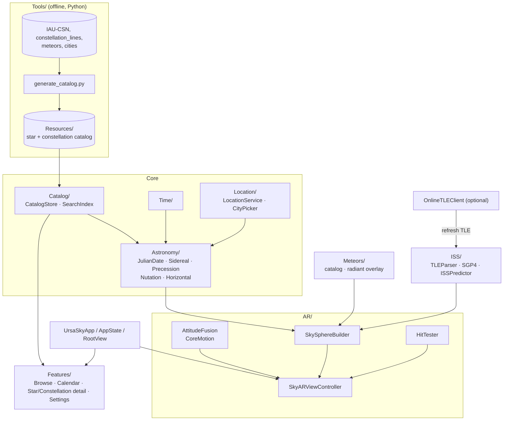

# Architecture

An offline AR planetarium. ARKit/SceneKit render a bundled star catalog over the camera; astronomy math runs locally. Only ISS TLE refresh uses the network.

```mermaid
flowchart TD
    subgraph Build["Tools/ (offline, Python)"]
        Gen[generate_catalog.py] --> Res[(Resources/<br/>star + constellation catalog)]
        IAU[(IAU-CSN, constellation_lines,<br/>meteors, cities)] --> Gen
    end

    App[UrsaSkyApp / AppState / RootView]
    Res --> Cat["Catalog/<br/>CatalogStore · SearchIndex"]

    subgraph Core
        Time[Time/] --> Astro["Astronomy/<br/>JulianDate · Sidereal · Precession<br/>Nutation · Horizontal"]
        Loc["Location/<br/>LocationService · CityPicker"] --> Astro
        Cat --> Astro
    end

    subgraph AR["AR/"]
        Att[AttitudeFusion<br/>CoreMotion] --> VC[SkyARViewController]
        Sph[SkySphereBuilder] --> VC
        Hit[HitTester] --> VC
    end

    ISS["ISS/<br/>TLEParser · SGP4 · ISSPredictor"]
    Net["OnlineTLEClient (optional)"] -->|refresh TLE| ISS
    Met[Meteors/<br/>catalog · radiant overlay]
    Feat["Features/<br/>Browse · Calendar · Star/Constellation detail · Settings"]

    Astro --> Sph
    ISS --> Sph
    Met --> Sph
    App --> VC
    App --> Feat
    Cat --> Feat
```
